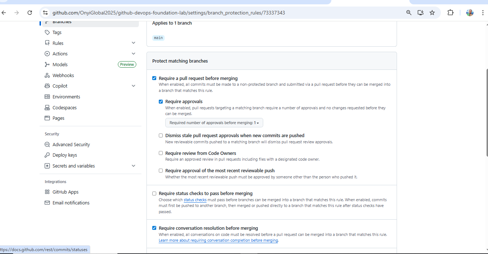
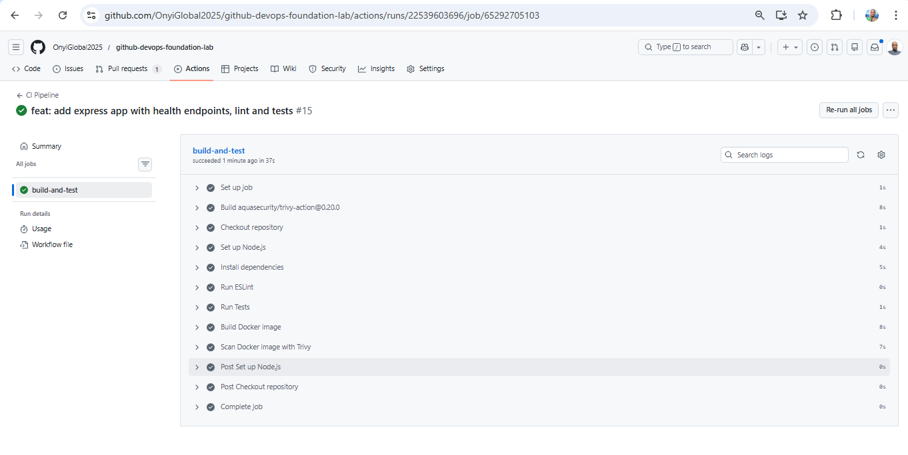
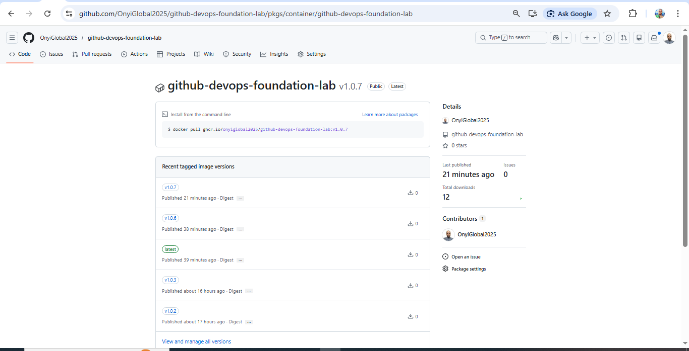
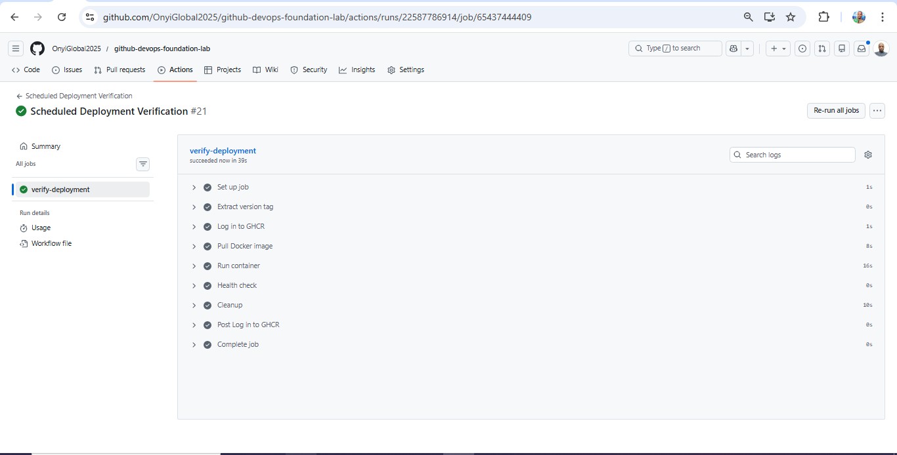

## GitHub DevOps Foundation Lab


Production-Grade CI/CD with Versioned Docker Deployments


## Project Overview

This project demonstrates a production-style CI/CD pipeline built using:

- GitHub Actions

- Docker (Multi-Stage Build)

- GitHub Container Registry (GHCR)

- Version-based deployments

- Scheduled deployment verification

- Branch protection & Pull Request workflow enforcement

What began as a simple Node.js app evolved into a structured, production-thinking DevOps workflow.


##  Project Evidence

Below are real runs from the pipeline showing the system working end-to-end.

### Branch Protection Enforced
Pull requests are required before merging into `main`.



### CI Pipeline Passing
The CI workflow builds, tests, scans, and pushes the Docker image.



### Versioned Docker Images in GHCR
Images are published with both `latest` and version tags (e.g., `v1.0.7`).



### Deployment Verification Workflow
A scheduled workflow pulls the tagged image, runs the container, and performs a health check.



## Workflow Architecture

```
Feature Branch
    ↓
Pull Request
    ↓
Branch Protection (PR required)
    ↓
Merge to Main
    ↓
CI Pipeline (build-test-scan-push)
    ↓
GHCR (latest + version tag)
    ↓
Scheduled Deployment Verification
    ↓
Container Health Check
```


## Branch Protection & PR Workflow

Main branch is protected with:

- ✅ Pull Request required before merge

- ✅ CI checks must pass before merge

- ❌ Direct pushes blocked


## Why This Matters

- Prevents broken code from reaching main

- Enforces team review discipline

- Aligns with real production Git workflows

This project simulates real-world DevOps collaboration standards.


## CI Pipeline

Triggered on:

- Push to main

- Version tags (v*)

Pipeline includes:

- Install dependencies

- Run ESlint

- Run tests

- Build Docker image

- Push to GHCR

- Tag images as:

    -  latest
 
    -  ${{ github.ref_name }} (e.g., v1.0.7)


## Version-Based Deployment Strategy

Instead of deploying latest, the verification workflow pulls explicit version tags:

```bash
ghcr.io/onyiglobal2025/github-devops-foundation-lab:v1.0.7
```


## Why Version Tags?

- Deterministic deployments

- Rollback capability

- Production traceability

- Prevents “latest drift” issues


## Scheduled Deployment Verification

A scheduled GitHub Actions workflow:

-   Pulls the tagged image

-   Runs the container

-   Executes health check (/healthz)

-   Validates deployment readiness

This simulates production deployment validation.


## Real Debugging Experience

During development, the following real-world issues were resolved:

-   Cannot find module './app' (multi-stage Docker copy issue)

-   Container exiting before health check

-   manifest unknown (tag mismatch)

-   CI/CD tag alignment issues

Each failure improved pipeline robustness and deployment reliability.


## What This Project Demonstrates

- Docker multi-stage production builds

- GitHub Actions CI/CD mastery

- GHCR image management

- Versioned artifact deployment

- Branch protection & PR discipline

- Production-grade debugging mindset


##  Design Decisions

This project intentionally implements several practices commonly used in production DevOps environments:

- **Branch Protection + PR Workflow**  
  Prevents direct pushes to `main` and ensures all changes pass CI checks before merging.

- **Multi-Stage Docker Build**  
  Separates dependency installation from the production image to reduce image size and improve security.

- **Version-Based Image Tagging**  
  Deployments use immutable version tags (e.g., `v1.0.7`) instead of `latest` to ensure reproducibility and safe rollback.

- **Automated Deployment Verification**  
  A scheduled workflow pulls the container image, runs it, and performs a health check to confirm the artifact is deployable.

These decisions were made to simulate how CI/CD pipelines operate in real engineering teams.


##  Future Improvements

Planned upgrades for this project include:

- Implementing **OIDC authentication** for secure cloud deployments
- Deploying the container to **AWS (ECS or Kubernetes)** using GitHub Actions
- Introducing **environment promotion** (dev → staging → production)
- Adding **image signing and security verification**
